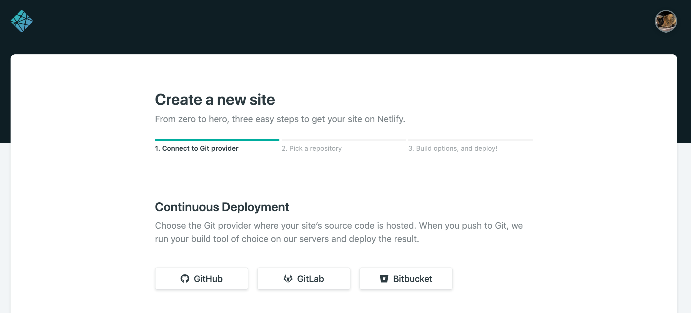

# netlify入門

## Netlifyのアカウント登録

Netlifyの公式ページにアクセス。「Sign up」をクリック。

[公式ページ](https://www.netlify.com/)

サインアップ画面で、アカウント作成方法を選ぶ。（以降は、「GitHubアカウント」で作成しているのを前提として記載）

[サインアップページ](https://app.netlify.com/signup)


GitHubアカウントによるNetlifyの認証。


Netlifyにログイン。クイックスタートガイドが表示される。


これで、Netlifyのアカウント登録が完了。


## リポジトリ作成

Netlifyと連携させる、GitHub上にリポジトリを作成する。

### リポジトリの完成イメージ

リポジトリの完成イメージは以下。

[リポジトリ完成イメージ](https://github.com/rykawamu/netlify-sample)

### リポジトリ作成作業

まず、GitHub上にリポジトリを作成。

リポジトリ名は「**netlify-sample**」などで、自分がわかるようにつければ良い。


ソースの構成は以下のイメージ。

```
root
  ∟ public/
      ∟ index.html
```

index.htmlの内容は以下。

```
<html>
<body>
    <h1>Hello Netlify</h1>
</body>
</html>
```

なお、上記のコードは、以下のリポジトリに用意している。

https://github.com/rykawamu/netlify-sample

## Netlifyの設定

GitHubのリポジトリを、Netlifyと連携させる。

「New site from Git」ボタンをクリック。


連携するGitプロバイダを選択する。（ここでは「GitHub」をクリック）



連携の認証画面が出てくるので、「Authorize 〜」ボタンをクリック


リポジトリを選択する画面の表示される


リポジトリが表示されていない時は、「Configure Netlify on GitHub」をクリック。


リポジトリを選択する。（権限があるものが表示される）


リポジトリを選択する。全てのリポジトリにする（「All repositories」）か、任意のリポジトリ（「Select repositories」）を選択する。今回は任意のリポジトリで対応する。


（※画面下に「Install」ボタンがある）


連携するリポジトリが選択された状態で、「Install」をクリックする。


連携するのにパスワードが表示される。


Netlify上で、リポジトリがPickされる。


ブランチを選択する。ここでは、「Master」ブランチを選択。


Publish directoryには「public/」を入力する。そして、「Deploy site」をクリックする。


デプロイ中の画面。


URLをブラウザに貼り付けて開く。（URLはデプロイ完了画面に載っている。）


一旦これで完了。**Nelify Fucttions** に続く。