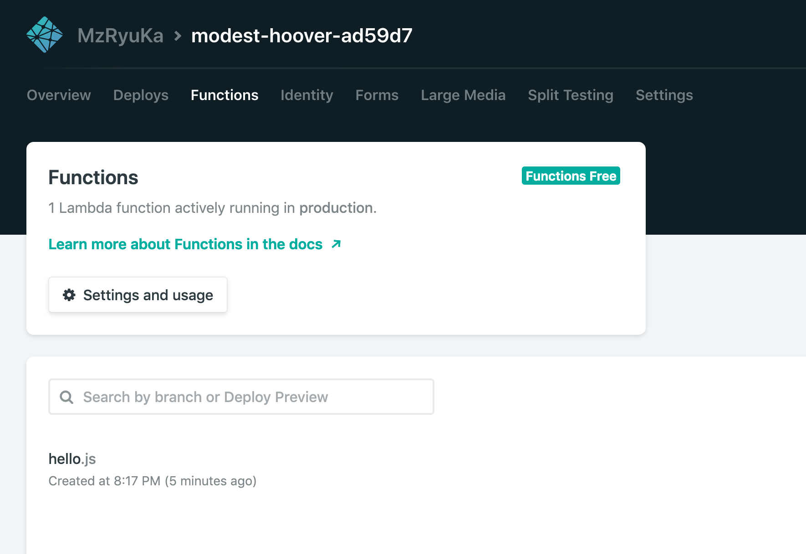
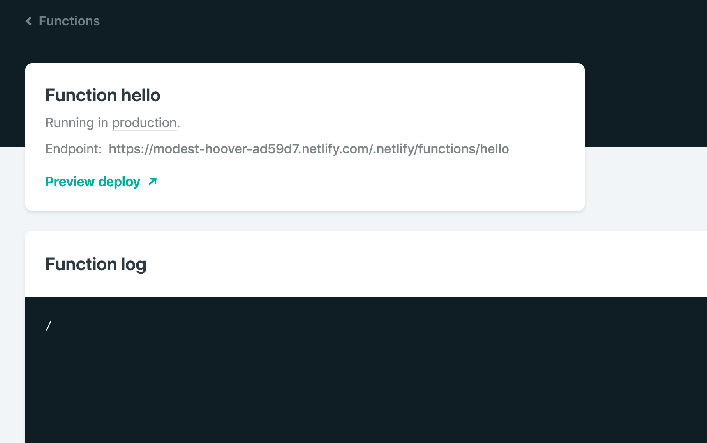
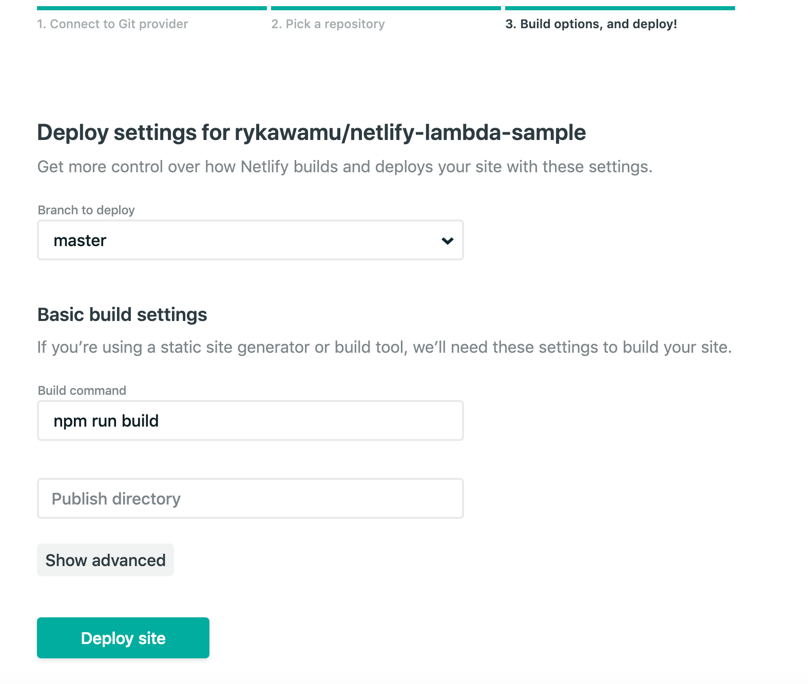
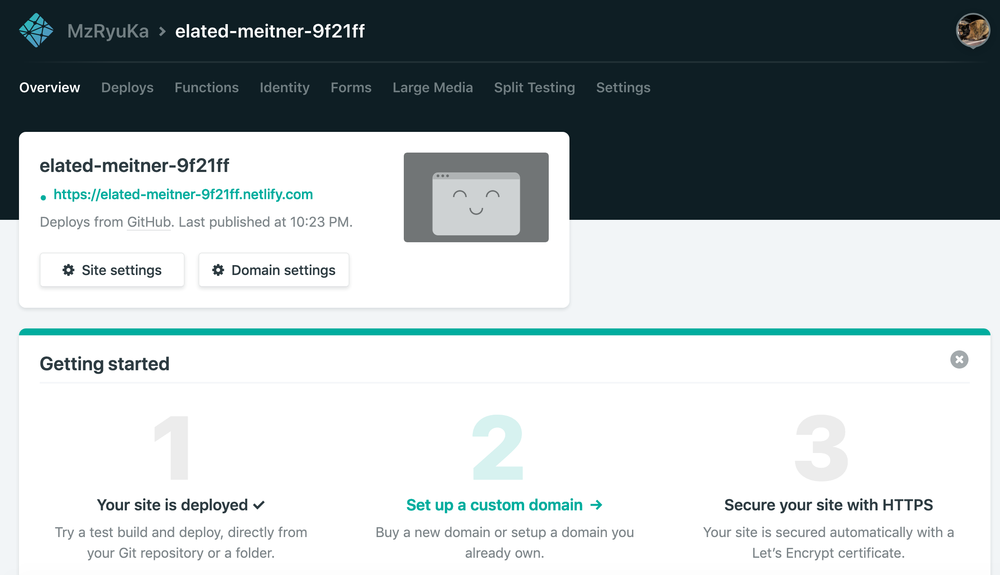
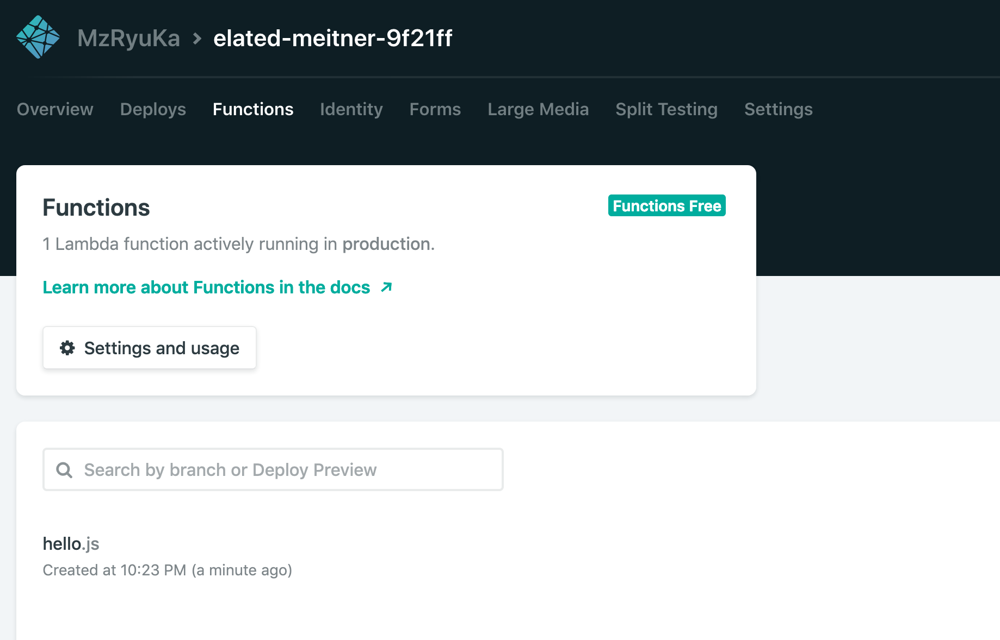
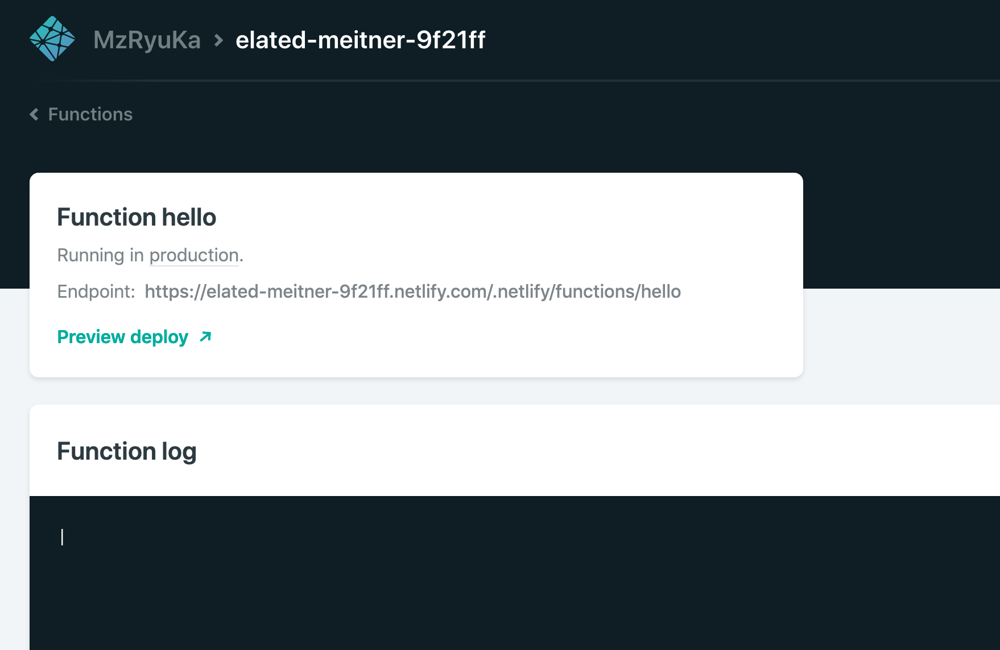
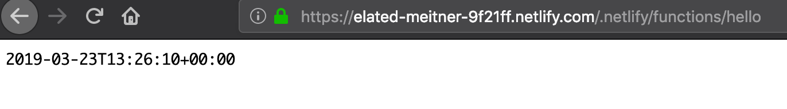

# Netlify Functions 入門

## Functions にHelloWorld

Netlify Fnctions を利用して、Hello World を実施します。

netlify入門で利用したリポジトリを利用して、Netlify Fnctionsを使います。

以下の二つのファイルを作成してください。

* netlify.toml
* functions/hello.js

ファイル構成は以下の通り。

```
root
　+ netlify.tom
  ∟ functions/
      ∟ hello.js
      
```

netlify.toml :

Functionsのディレクトリを「 functions 」設定する。

```
[build]
functions = "functions"
```

functions/hello.js :

こちらがHelloWorldの本体となります。

```
exports.handler = function(event, context, callback) {
  callback(null, {
    satusCode: 200,
    body: "Hello, World"
  });
}
```

この二つのファイルcommitし、その後masterへpush します。

すると、Netlify上でデプロイが行われます。

デプロイが成功すると、以下のように「Functions」タブをクリックすると、画面下に「hello.js」が表示されます。



これによって、Netlify FUnctionsとして「hello.js」が登録されたことになります。

そして、「hello.js」をクリックすると、以下のような詳細画面が表示されます。そして、「Endpoint:」の箇所にURLが書かれています。



画面中に表示されているURLをブラウザで確認すると、ブラウザ画面中に「Hello, World」が表示されます。

https://modest-hoover-ad59d7.netlify.com/.netlify/functions/hello

このように、Netlify で Functionsを利用する際には、Functions のディレクトリにファイル（関数）を用意していくことになります。

## netlify-lambdaを利用する

**netlify-lambda**は、webhookというバンドルツールのラッパーライブラリです。そのnetlify-lambdaを利用したNetlify Functionsの使い方の説明を補足します。

新しくリポジトリを作成して、進めます。今回のリポジトリ名は、「**netlify-lambda-sample**」としておきます。

完成ソースイメージは、以下のリポジトリに用意しています。

https://github.com/rykawamu/netlify-lambda-sample

### ソースコード準備

以下のファイルを用意します。

* netlify.toml
* package.json
* .gitignore
* src/hello.js

ファイル構成は以下のようになります。（一部表記省略）

```
root
　+ .gitignore
　+ package.json
　+ netlify.tom
  ∟ functions/
      ∟ hello.js
```


まず、GitHub上にリポジトリを作成し、そのリポジトリをcloneした後で、以下のnpmコマンドを実行します。

```
$ npm init -y
$ npm install --save moment
$ npm install --save netlify-lambda
```

1行目で、package.jsonが生成されます。2行目で、「**moment.js**」という日時を扱うライブラリが、3行目では「**netlify-lambda**」のパッケージがインストールされます。


.gitignore ：

リポジトリに含めないディレクトリを設定しておきます。

```
functions
node_modules
```


src/hello.js :

こちらが今回の実行コードの内容となります。レスポンスデータのbodyに、現在日時を設定してます。

```
import moment from 'moment'

exports.handler = function(event, context, callback) {
  callback(null, {
    statusCode: 200,
    body: moment().format()
  });
}
```

package.json :

最初に実行したnpm init コマンドでpackage.jsonの雛形ができています。
そこにnetlify-lambdaを実行する**npm scripts**を追記します。以下はscriptsの部分を抜粋しています。

```
  "scripts": {
    "build": "netlify-lambda build src/",
    "serve": "netlify-lambda serve src/"
  },
```

ここまで準備した後、以下のコマンドを実行。

```
$ npm run serve
```

その後、ブラウザで以下のURLにアクセスすると、画面中に現在事項が表示される。

http://localhost:9000/hello


### Netlifyのbuild設定

以下のコマンドを実行すると、functionsディレクトリが出来上がり、その下に、hello.jsが生成されます。

```
$ npm run build
```

netlify.toml :

Functionsのディレクトリを「 functions 」設定する。また、netlify側で実行するビルドコマンドも定義する。

```
[build]
  functions = "functions"
  command = "npm run build"
```

ここまで実施して、ソースコードをcommit、GitHubリポジトリにpushする。

以降は、Netlify側での処理となる。

## Netlify側との連携

netlifyにログインして、上記で利用したリポジトリとnetlifyを連携させる。

その際に「Build command」の欄には「**npm run build**」と入力しておきます。



連携して、デプロイ中。



デプロイが完了したら、「Functions」をクリック。



画面中に、hello.jsが表示されているのでクリック。



EndpointにURLが表示されているので、そのURLをブラウザに貼り付て実行。



画面中に、現在日時が表示される。リロードすれば、時刻は変わっていく。

これで一旦完了。Netlifyを利用した**LINE Bot開発**に続く。