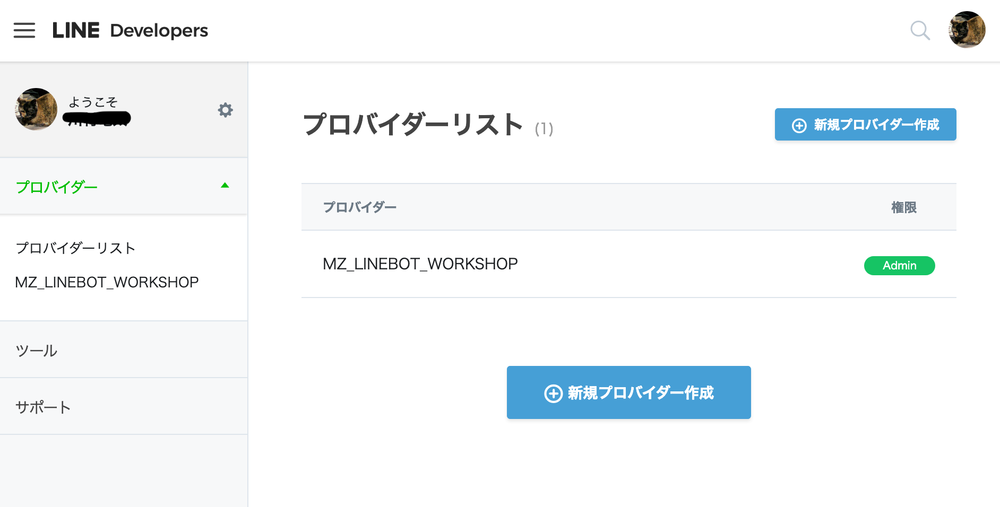
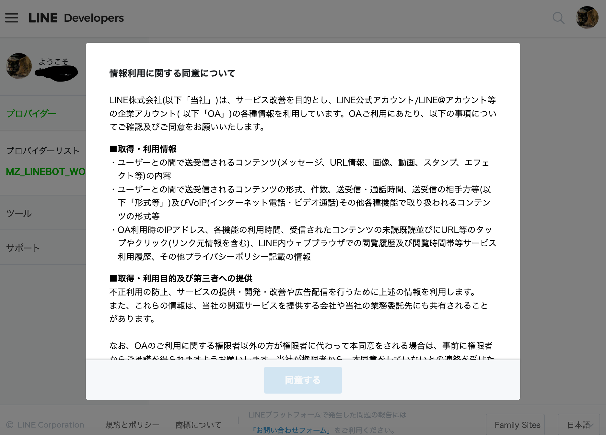
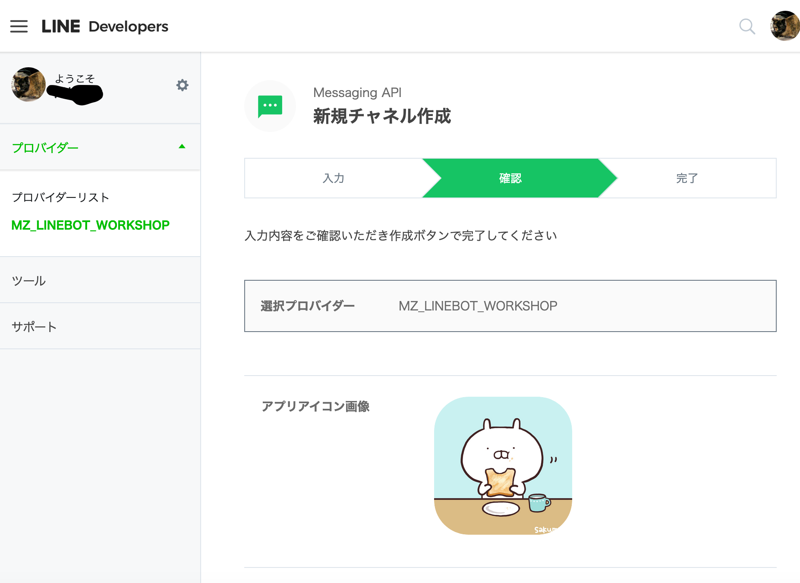
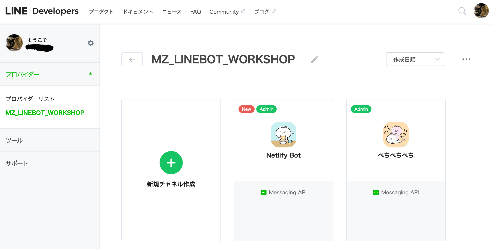
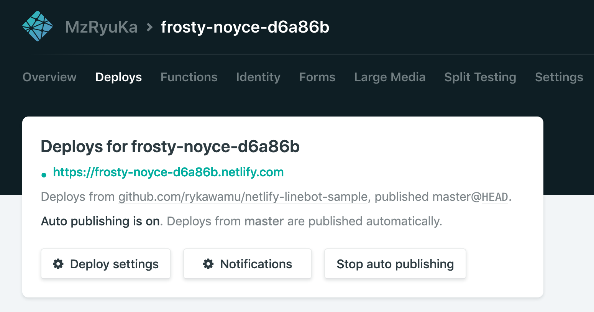

# LINE Bot開発

## LINE Developers のプロバイダーとチャネルの作成

以下、LINE Developersのアカウントがあり、LINE Developersにログインしている前提で記述しています。

### チャネルの新規作成

メニューから「プロバイダーリスト」を選択。「新規プロバイダー作成」をクリックして、プロバイダーを作成します。プロバイダー名は任意の名前で良いです。（既存のプロバイダーを利用しても構いません）



プロバイダー作成後、プロバイダー名をクリックして、配下に登録されているチャネルの一覧を表示します。チャネルがない場合は、「新規チャネル作成」をクリック。


「新規チャネル作成」をクリックすると、ポップアップが表示されるので「**Messaging API**」をクリック。


チャネル登録画面（その１）


チャネル登録画面（その２）


チャネル登録画面（その３）


アイコン、アプリ名、アプリの説明を入力。**アプリ名**は、そのままLINE Botにした時の「友達の名前」になります。


プランは、**Developers Trial**で良いです。

なお、フリープランとの違いは、以下。

* Developers Trial : Push messageも使えるが、友達50人まで。
* フリー : 友達が無制限だが、Push messageは使えない。


利用規約が表示される。



利用規約を全部読んで（下までいって）、「同意する」ボタンをクリック。


チャネルの確認画面（その１）



チャネルの確認画面（その２）


チャネルの確認画面（その３）

ここで「作成」をクリックして完了となる。


チャネル一覧に、作成したチャネルが登録されている。



作成したチャネルをクリックしたら、画面の一番下に「QRコード」があるので、それをLINE端末で読み取って友達になる。


一旦、LINE Developers側の設定は終わり。

## Netlify側の準備

LINE Bot用の新しいリポジトリをGitHub上に作成する。

作成イメージを以下のGitHubに用意しました。

https://github.com/rykawamu/netlify-linebot-sample

ソースコードは上のリポジトリで紹介するので、ここでは記載しません。

利用するコードは、以下の二つになります。

* ping.js : 接続確認のためのコード
* reply.js : LINE Botとして応答してくれるコード

なお、reply.jsでは「**axios**」というライブラリを利用します。ローカルで確認する場合、以下のように「axios」をインストールする。

```
$ npm install --save axios
```


Netlify側でも、新しいサイト（Sites）を準備。


準備1。


準備2。


準備3。


準備4。


準備5。対象のリポジトリ（画像だと「**netlify-linebot-sample**」）を選択してデプロイを実施。


Netlifyで「Functions」を確認。

ping.jsをクリック。


Endpoint のURLが表示されるので、それをコピー。


上でコピーしたURLをブラウザに貼り付けて実行。jsonデータが返ってくる。


## LINE Botを使うためのチャネルの設定

再びLineDevelopers側の設定。

先ほど新規に作成したチャネルをクリック。


設定の変更をする。

変更前：

* Webhook: 利用しない
* Webhook URL: 未設定


それぞれ、横にある「編集」ボタンをクリックして、設定を変更する。

変更後：

* Webhook: **利用する**
* Webhook URL: *利用するURLを入力。*


接続確認の実施。成功可否が表示される。


Netlify側のFunctionログを見てみると、ログデータが表示されている。


再び、LINE Developers側で「**アクセストークン**」を発行する。


「再発行」をクリックする。


「**アクセストークン**」が発行される。この値をコピーする。


「Deploys」で「Deploy settings」をクリック。



「Build & deploy」をクリックして、「**Build environment variables**」に環境変数を設定する。

* Key: **CHANNEL_TOKEN**
* Value: コピーしたアクセストークンを設定。


「Functions」から「reply.js」を選択。


EndpointのURLをコピー。


LINEのチャネル側の「Webhook URL」をpingから**`コピーしたreply`**のURLへ変更。


この状態で、友達になったLINE Botに話しかけると、LINE Botが「**Hello Netlify Bot**」と返してくれる。

あとは、GitHubリポジトリに登録されている別のFunctionsのURLを指定するなどして動作確認してみてください。

* quickReplay.js
* game.js

今回はここまで。